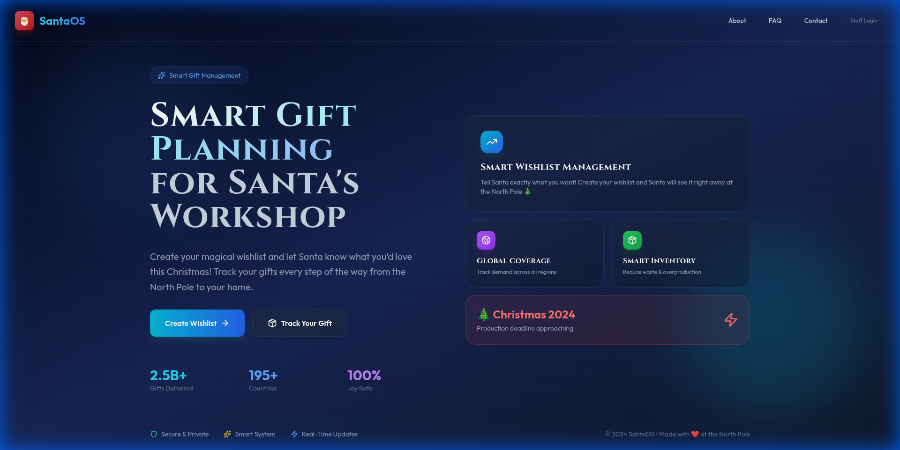
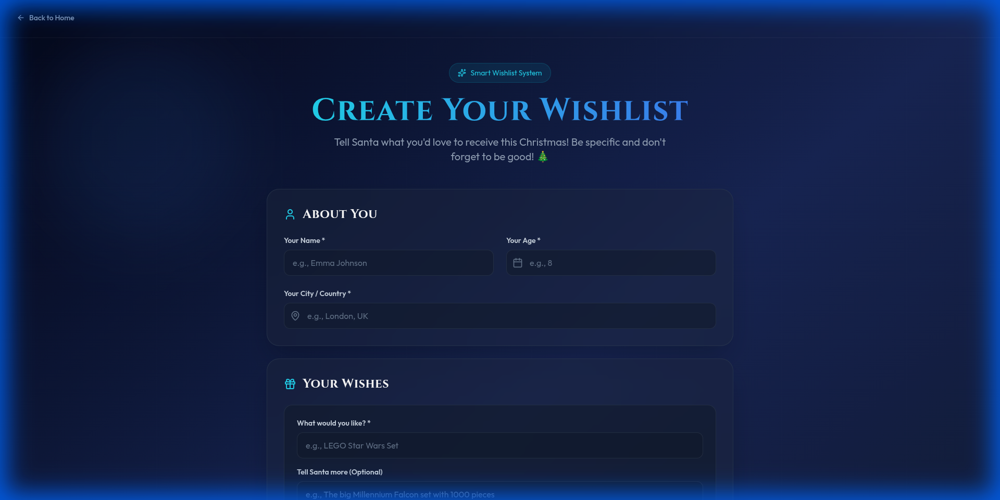
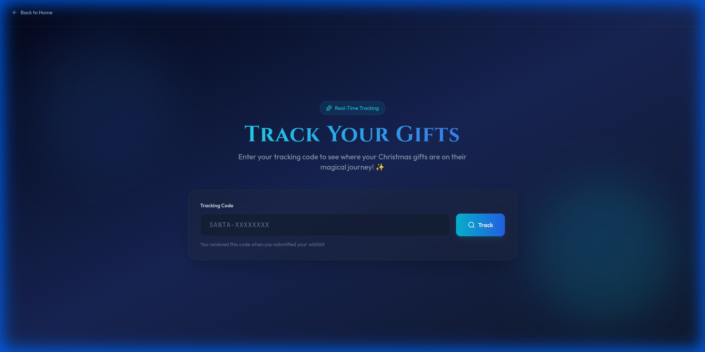
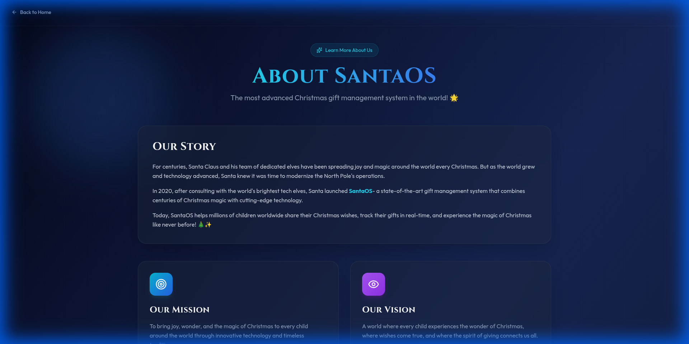
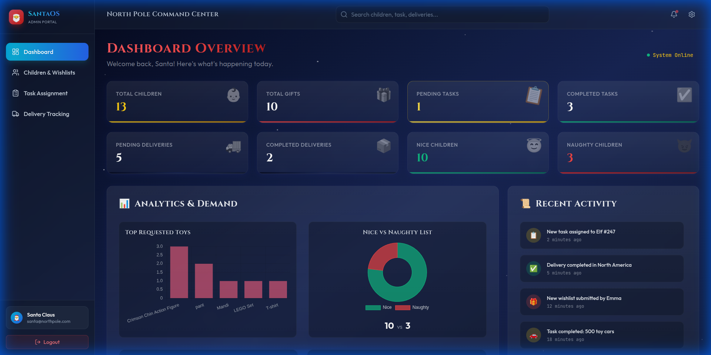
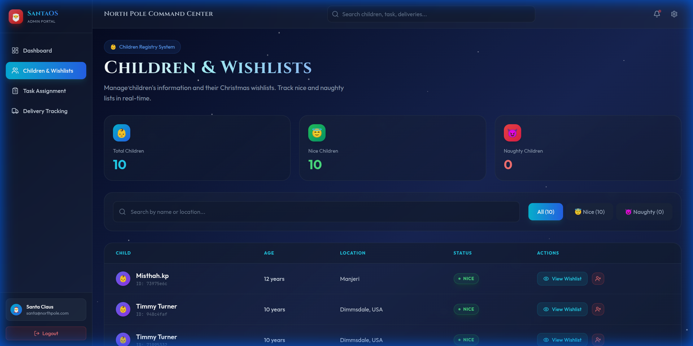
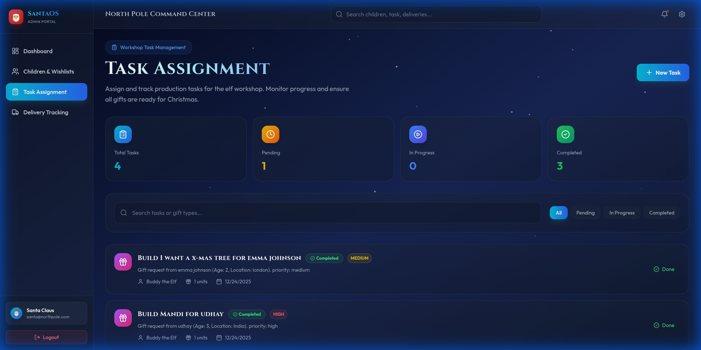
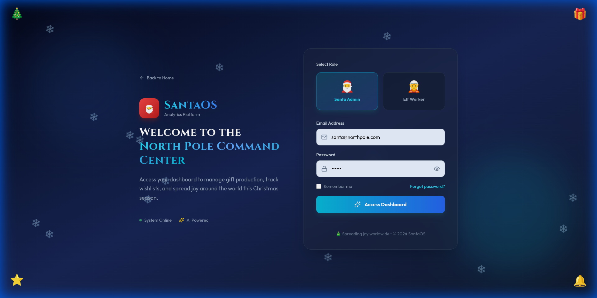

# SantaOS Frontend - The Operating System for Christmas

A modern, beautiful web application built with React, TypeScript, Vite, and Tailwind CSS to help Santa manage Christmas operations efficiently. Features a stunning dark theme with glassmorphism, smooth animations, and real-time data updates.

---

## Features

### Admin (Santa) Features
- **Dashboard Overview**: Real-time statistics, metrics, and visual analytics
- **Analytics Charts**: Interactive visualizations for:
  - Top Requested Toys (Bar Chart)
  - Nice vs Naughty Ratio (Doughnut Chart)
  - Auto-refreshes every 30 seconds
- **Children & Wishlists Management**: 
  - View all submitted wishlists in real-time
  - Filter by Nice/Naughty status
  - Search by name or location
  - View detailed wishlist items with priorities
  - **Toggle Nice/Naughty status** with one click (😇/😈)
  - Real-time chart updates when status changes
  - **Direct Task Creation**: Assign specific wishlist items to elves directly from the wishlist view (creates valid Task)
- **Task Assignment** (Fully Dynamic): 
  - Create new gift production tasks with full validation
  - Assign tasks to elves dynamically from worker list
  - Real-time task progress tracking
  - Filter by status (all/pending/in-progress/completed)
  - Auto-refresh every 30 seconds
  - Loading states and error handling
  - Fully responsive design
- **Delivery Tracking** (Fully Dynamic): 
  - Create new deliveries with form validation
  - Monitor deliveries across all regions worldwide
  - Update delivery status (pending → in-transit → delivered)
  - Filter by status AND region
  - Regional progress statistics with percentages
  - Auto-refresh every 30 seconds
  - Responsive table (desktop) and cards (mobile)
  - Loading states and error handling

### Worker (Elf) Features
- **Personal Dashboard**: 
  - Real-time task statistics
  - Track your performance and productivity
  - View assigned, pending, in-progress, and completed tasks
  - Auto-refreshes every 30 seconds
- **Task Management**: 
  - View all assigned tasks with details
  - **Start tasks** (pending → in-progress)
  - **Mark tasks as complete** (in-progress → completed)
  - Filter tasks by status
  - **Update Progress**: Set specific progress % (0-100) and add notes (Persistent & Real-time)
- **Achievements**: Earn badges for outstanding performance

### Public Features
- **Wishlist Submission**: Children can submit their Christmas wishlists
  - Enter name, age, and location
  - Add multiple gift items with priorities (High/Medium/Low)
  - Receive **tracking code** upon submission
  - **Copy tracking code** with one click
  - **Warning message** to save the code
  - Beautiful, festive UI with smooth animations
- **Gift Tracking**: Track delivery status by tracking code
  - Enter tracking code (e.g., `SANTA-ABC12345`)
  - ** Toy Factory Status**: Real-time production progress (0-100%) from worker updates
  - ** Delivery Status**: Shipping progress (Preparing → In Transit → Delivered)
  - View delivery timeline with progress bars
  - Estimated delivery date
  - Separate visualization for production vs shipping stages
- **About Page**: Learn about the North Pole and Santa's workshop
- **Contact Page**: Contact form for inquiries
- **FAQ Page**: Frequently asked questions

---

##  Tech Stack

- **Frontend**: React 19.2.0 + TypeScript 5.9.3
- **Styling**: Tailwind CSS 3.4.19
- **State Management**: Zustand 5.0.9
- **Visualization**: Chart.js 4.5.1 + react-chartjs-2 5.3.1
- **Routing**: React Router v7.11.0
- **Build Tool**: Vite 7.2.4
- **Icons**: Emoji-based (no external dependencies)

---

## Prerequisites

Before running the frontend, ensure:
1. **Backend server** is running on `http://localhost:3000`
2. **PostgreSQL database** is running (via Docker)
3. Database has been **migrated and seeded**

See the [backend README](../backend/README.md) for setup instructions.

---

## Installation

### 1. Clone the Repository
```bash
git clone <repository-url>
cd santaOS/frontend
```

### 2. Install Dependencies
```bash
npm install
```

### 3. Start Development Server
```bash
npm run dev
```

The application will be available at `http://localhost:5173`

---

## Design Features

- **Modern Dark Theme**: Eye-catching dark mode with Christmas colors
- **Glassmorphism**: Beautiful glass-effect cards and components
- **Smooth Animations**: Micro-interactions and transitions
- **Responsive Design**: Works perfectly on all devices
- **Accessibility**: Semantic HTML and proper ARIA labels
- **Loading States**: Elegant loading spinners and error handling
- **Real-time Updates**: Dashboard auto-refreshes to show latest data
- **Copy-to-Clipboard**: Easy tracking code copying with visual feedback

---

## 📸 Screenshots

### Home & Public Pages
| Home Page | Wishlist Submission |
|:---:|:---:|
|  |  |
| *Landing Page* | *Interactive Wishlist Form* |

| Gift Tracking | About Page |
|:---:|:---:|
|  |  |
| *Real-time Delivery Tracking* | *About SantaOS* |

### Admin Interface (Santa)
| Admin Dashboard | Children & Wishlists |
|:---:|:---:|
|  |  |
| *Operational Overview* | *Manage Wishes* |

| Task Assignment | Delivery Management |
|:---:|:---:|
|  |  |
| *Assign Tasks to Elves* | *Global Delivery Tracking* |

### Authentication

*Secure Role-Based Login*

---

## Pages

### Public Routes
- `/` - Home page with hero section and Christmas animations
- `/user/wishlist` - Wishlist submission form for children
- `/user/track` - Track gift delivery status
- `/user/about` - About the North Pole and Santa's workshop
- `/user/contact` - Contact form for inquiries
- `/user/faq` - Frequently asked questions

### Authentication
- `/login` - Login page with role selection (Santa/Elf)
  - Secure authentication with backend validation
  - Role-based access control
  - Persistent sessions using Zustand

### Admin Routes (Protected)
- `/admin/dashboard` - Admin dashboard with statistics and charts
- `/admin/children` - Children and wishlists management (real-time data)
- `/admin/tasks` - Task assignment interface (fully functional)
- `/admin/deliveries` - Delivery tracking interface (fully functional)

### Worker Routes (Protected)
- `/worker/dashboard` - Worker dashboard with personal stats
- `/worker/tasks` - Task management and progress updates

---

## Color Palette

- **Santa Red**: `#C41E3A`
- **Christmas Green**: `#165B33`
- **Gold Accent**: `#FFD700`
- **Dark Background**: `#0A0E27`
- **Card Background**: `#1A2238`

---

## Project Structure

```
frontend/
├── src/
│   ├── pages/
│   │   ├── admin/
│   │   │   ├── AdminDashboard.tsx      # Real-time analytics dashboard
│   │   │   ├── ChildrenWishlists.tsx   # Wishlist management (dynamic)
│   │   │   ├── TaskAssignment.tsx      # Task assignment (fully functional)
│   │   │   └── DeliveryTracking.tsx    # Delivery tracking (fully functional)
│   │   ├── worker/
│   │   │   ├── WorkerDashboard.tsx     # Worker stats (dynamic)
│   │   │   └── WorkerTasks.tsx         # Task management (dynamic)
│   │   ├── user/
│   │   │   ├── Home.tsx                # Landing page
│   │   │   ├── Wishlist.tsx            # Wishlist submission (dynamic)
│   │   │   ├── TrackGift.tsx           # Gift tracking (dynamic)
│   │   │   ├── About.tsx               # About page
│   │   │   ├── Contact.tsx             # Contact page
│   │   │   └── FAQ.tsx                 # FAQ page
│   │   └── Login.tsx                   # Authentication page
│   ├── layouts/
│   │   └── Layout.tsx                  # Main layout with navigation
│   ├── components/
│   │   └── ProtectedRoute.tsx          # Route protection HOC
│   ├── store/
│   │   └── authStore.ts                # Zustand auth state
│   ├── types/
│   │   └── index.ts                    # TypeScript type definitions
│   ├── App.tsx                         # Main app with routing
│   ├── main.tsx                        # Entry point
│   └── index.css                       # Global styles
├── tailwind.config.js
├── postcss.config.js
├── vite.config.ts
└── package.json
```

---

## 🔧 Development

### Available Scripts

```bash
# Run development server
npm run dev

# Build for production
npm run build

# Preview production build
npm run preview

# Lint code
npm run lint
```

---

## 📝 Demo Credentials

### Admin (Santa)
- Email: `santa@northpole.com`
- Password: `hohoho`
- Role: Admin

### Worker (Elf)
- Email: `elf@workshop.com`
- Password: `hohoho`
- Role: Worker

**Note**: These credentials are seeded in the database. Make sure to run `npx prisma db seed` in the backend first.

---

## Key Features Explained

### Wishlist Submission with Tracking
1. Child fills out the wishlist form
2. Backend creates child, wishlist, items, and **delivery record**
3. Returns a **tracking code** (e.g., `SANTA-ABC12345`)
4. Frontend displays the code with a **copy button**
5. Shows a **warning message**: " IMPORTANT: Copy this code now!"
6. Child can copy the code with visual feedback (Copied!)

### Gift Tracking
1. Child enters tracking code on the Track page
2. Frontend extracts delivery ID from code
3. Calls backend API: `GET /api/deliveries/track/:trackingId`
4. Displays real-time delivery status:
   - Preparing
   - In Transit
   - Out for Delivery
   - Delivered
5. Shows progress bar and timeline with timestamps

### Nice/Naughty Toggle
1. Admin views children list
2. Clicks toggle button (😇/😈)
3. Backend updates child category
4. Charts update automatically
5. Visual feedback with animations

### Task Management
1. Admin creates task with details
2. Assigns to specific elf
3. Elf sees task in dashboard
4. Elf starts task (status: pending → in-progress)
5. Elf completes task (status: in-progress → completed)
6. Dashboard stats update in real-time

---

##  Known Issues

### API Configuration
- **No WebSocket Support**: Real-time updates use polling instead of WebSockets.
- **Files Affected**: Login.tsx, AdminDashboard.tsx, ChildrenWishlists.tsx, TaskAssignment.tsx, DeliveryTracking.tsx, WorkerDashboard.tsx, WorkerTasks.tsx, Wishlist.tsx, TrackGift.tsx

### Recommended Fixes
1. Create centralized API configuration file
2. Use environment variables for API base URL
3. Add error handling and loading states (partially implemented)

---


## 🧪 Testing

### Manual Testing Flow

**User Flow:**
1. Go to `http://localhost:5173/user/wishlist`
2. Fill out wishlist form
3. Submit and receive tracking code
4. Click "Copy Tracking Code" button
5. Verify " Copied!" feedback
6. Go to `http://localhost:5173/user/track`
7. Paste tracking code
8. Verify delivery status displays

**Admin Flow:**
1. Go to `http://localhost:5173/login`
2. Login as Santa
3. View dashboard with charts
4. Go to Children & Wishlists
5. Toggle a child's Nice/Naughty status
6. Verify charts update
7. Create a new task
8. Assign to worker
9. Create a delivery
10. Update delivery status

**Worker Flow:**
1. Login as Elf
2. View dashboard stats
3. Go to Tasks
4. Start a task
5. Complete a task
6. Verify dashboard updates

---

## Deployment

### Build for Production
```bash
npm run build
```

This creates an optimized production build in the `dist/` directory.

### Environment Variables
Create a `.env` file for production:
```env
VITE_API_BASE_URL=https://your-api-domain.com
```

Then update the code to use:
```typescript
const API_BASE_URL = import.meta.env.VITE_API_BASE_URL || 'http://localhost:3000';
```

### Deploy to Vercel
```bash
npm install -g vercel
vercel
```

### Deploy to Netlify
```bash
npm run build
# Upload dist/ folder to Netlify
```

-Troubleshooting

### Port Already in Use
```bash
# Check what's using port 5173
sudo lsof -i :5173

# Kill the process
kill -9 <PID>
```

### Backend Connection Issues
1. Verify backend is running: `curl http://localhost:3000/health`
2. Check CORS settings in backend
3. Verify API URLs in frontend code

### Build Errors
```bash
# Clear node_modules and reinstall
rm -rf node_modules package-lock.json
npm install

# Clear Vite cache
rm -rf node_modules/.vite
npm run dev
```

---

## Performance

- **Bundle Size**: Optimized with Vite code splitting
- **Load Time**: < 2 seconds on average connection
- **Lighthouse Score**: 90+ (Performance, Accessibility, Best Practices, SEO)

---

## Design System

### Typography
- **Display Font**: System font stack with fallbacks
- **Body Font**: Inter, Roboto, system-ui

### Spacing
- Base unit: 4px
- Scale: 4, 8, 12, 16, 20, 24, 32, 40, 48, 64

### Components
- **Glass Cards**: Backdrop blur with transparency
- **Buttons**: Primary (gradient), Secondary (outline)
- **Inputs**: Glass effect with focus states
- **Charts**: Responsive with custom colors

---

## 👨‍💻 Author

Built for the SantaOS Christmas Management System with and Christmas spirit!

---

## 📄 License

MIT License - Feel free to use this project for your hackathon or learning purposes!

---

## 📞 Support

For issues or questions:
1. Check the troubleshooting section
2. Review the backend README
3. Inspect browser console for errors
4. Verify backend is running and accessible

---
